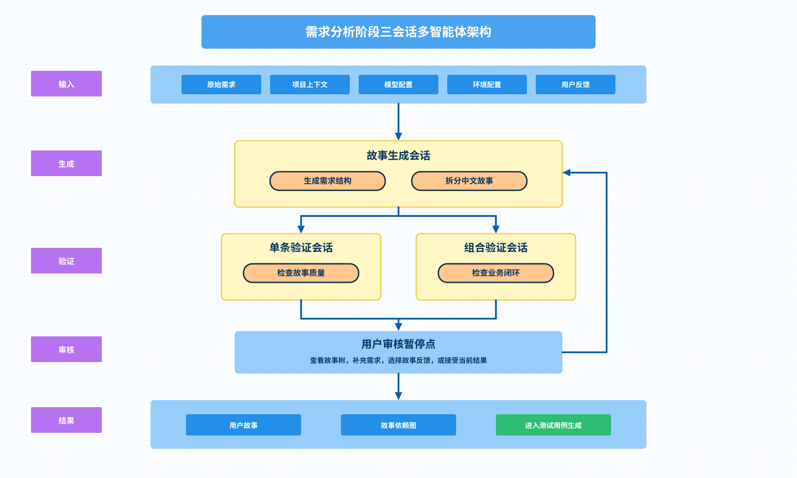

# 需求分析阶段架构图

状态：草案  
最后更新：`2026-05-23`

这张图从“故事生成、单条验证、组合验证”三个核心会话智能体的角度展示需求分析阶段：

- `故事生成会话`：生成结构化需求说明、能力分组和用户故事
- `单条验证会话`：检查每条用户故事的粒度、可测试性、依赖和叙事质量
- `组合验证会话`：从集成测试视角检查整组用户故事是否覆盖主流程、异常路径和权限路径

格式解析和质量检查不作为独立智能体，而是作为故事生成会话之后的规则门禁。用户反馈、继续优化和组合问题修订都回流到故事生成会话，由编排器决定下一轮进入哪一个验证会话。

如果你想把它继续扩展成“可和现有流程图并排使用”的版本，我可以再补一版更偏产品说明的简化图。
