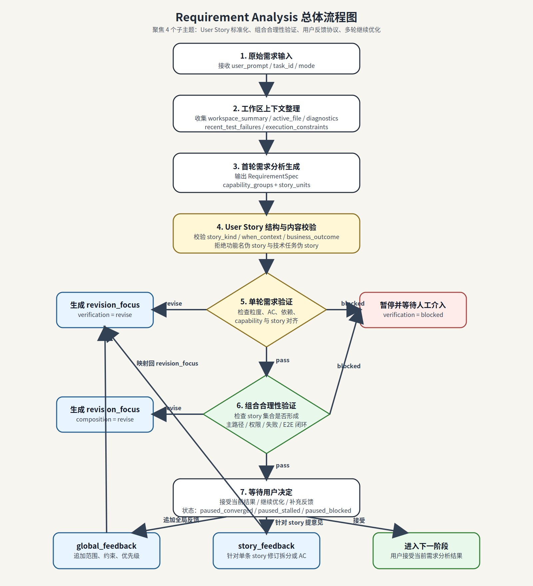
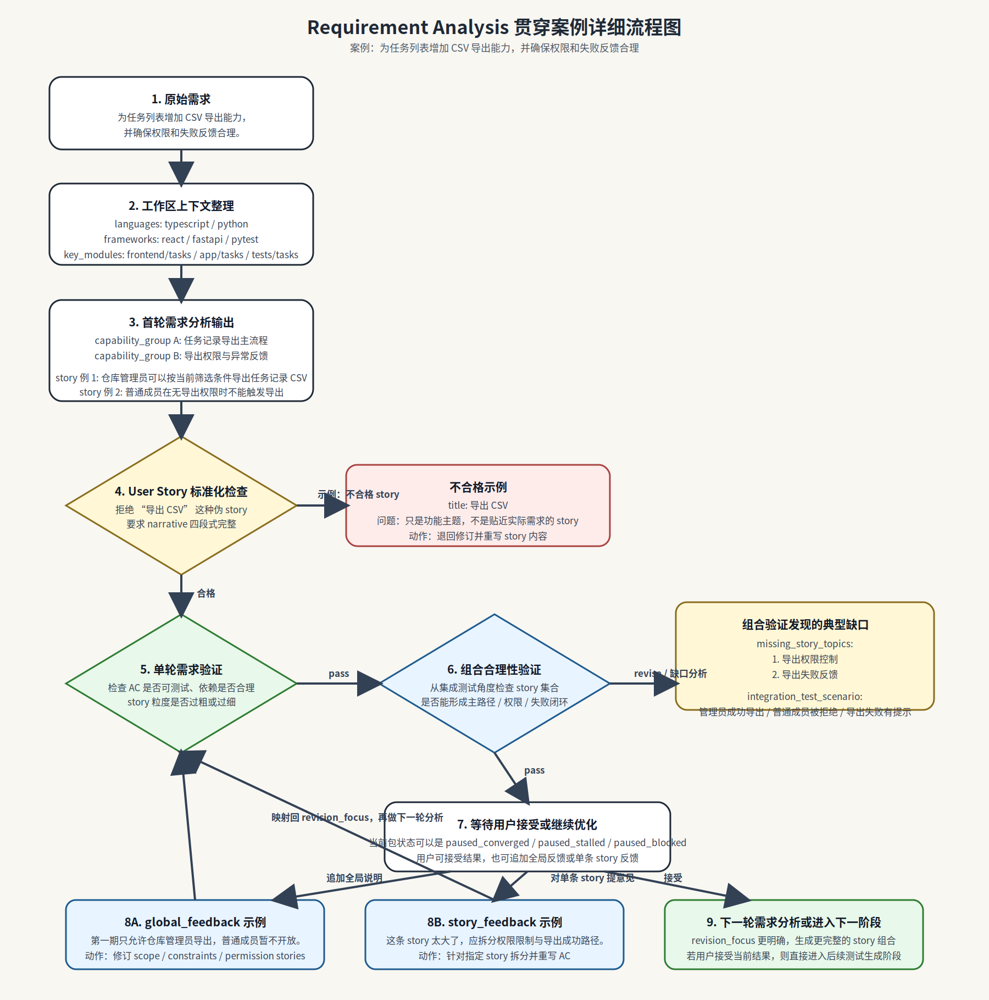

# Requirement Analysis 流程图与示例 v1

状态：草案
最后更新：`2026-05-11`

## 1. 目标

这份文档回答两个问题：

1. 需求分析阶段现在的完整流程是什么
2. 每一步在一个真实案例里到底做什么

这里的流程图不是抽象理想图，而是基于当前已收口的 4 个子主题：

- `User Story` 标准化
- 组合合理性验证
- 用户反馈协议
- 多轮继续优化机制

## 2. 总体流程图



## 3. 同一案例贯穿说明

下面所有步骤都使用同一个案例：

```text
为任务列表增加 CSV 导出能力，并确保权限和失败反馈合理。
```

这个案例适合贯穿演示，因为它同时具备：

- 主路径
- 权限路径
- 失败路径
- 可拆成多个 story
- 适合做组合验证

## 4. 贯穿案例详细流程图



## 5. 第 1 步：原始需求输入

### 4.1 当前目标

接收用户最原始的需求，不要求一开始就结构化。

### 4.2 示例

原始输入：

```text
为任务列表增加 CSV 导出能力，并确保权限和失败反馈合理。
```

### 4.3 当前阶段产物

- `user_prompt`
- `task_id`
- `mode`

### 4.4 这一阶段不做什么

- 不直接拆 story
- 不直接生成测试
- 不直接推断所有边界

## 6. 第 2 步：工作区上下文整理

### 5.1 当前目标

把 IDE 和仓库上下文整理成需求分析输入的一部分。

### 5.2 示例

可能的上下文摘要：

```json
{
  "languages": ["typescript", "python"],
  "frameworks": ["react", "fastapi", "pytest"],
  "key_modules": ["frontend/tasks", "app/tasks", "tests/tasks"]
}
```

### 5.3 当前阶段产物

- `workspace_summary`
- `active_file`
- `open_files`
- `diagnostics`
- `recent_test_failures`
- `execution_constraints`

### 5.4 为什么需要这一步

同一句需求在不同项目里会有完全不同的拆解方式。

例如：

- 如果已有任务列表筛选逻辑，导出 story 就应强调复用现有筛选结果
- 如果权限体系已经存在，权限 story 就应贴近现有角色模型

## 7. 第 3 步：首轮需求分析生成

### 6.1 当前目标

生成第一版：

- `RequirementSpec`
- `capability_groups`
- `story_units`

### 6.2 示例

第一版 capability 分组可能是：

- `任务记录导出主流程`
- `导出权限与异常反馈`

第一版 story 可能是：

- `仓库管理员可以按当前筛选条件导出任务记录 CSV`
- `普通成员在无导出权限时不能触发任务记录导出`
- `仓库管理员在导出失败时可以得到明确的失败原因和下一步操作提示`

### 6.3 这一阶段最关键的要求

这里生成的 story 必须已经符合标准化约束：

- 不是功能主题
- 不是模块名
- 不是技术任务
- 必须是完整 `User Story`

## 8. 第 4 步：User Story 结构与内容校验

### 7.1 当前目标

检查 story 是否同时满足：

- 结构正确
- 内容合格

### 7.2 示例

不合格：

- `导出 CSV`

合格：

- `仓库管理员可以按当前筛选条件导出任务记录 CSV`

### 7.3 当前会检查什么

- 是否有 `story_kind`
- 是否有 `when_context`
- 是否有 `business_outcome`
- `narrative` 是否符合四段式
- title 是否只是功能名
- story 是否明显是技术任务

## 9. 第 5 步：单轮需求验证

### 8.1 当前目标

这一层负责检查“单轮拆解质量”。

关注点是：

- story 粒度是否合适
- 验收标准是否可测试
- story 依赖是否合理
- capability group 与 story 是否基本一致

### 8.2 示例

如果第一轮只生成：

- `仓库管理员可以按当前筛选条件导出任务记录 CSV`

但没有权限限制和失败反馈 story，那么这一步有可能先给出：

- `pass`

原因：

- 单条 story 本身可能写得没问题
- 它在单 story 质量上是合格的

这也是为什么第 6 步必须独立存在。

## 10. 第 6 步：组合合理性验证

### 9.1 当前目标

检查整组 story 组合起来是否合理。

### 9.2 为什么单独做

因为“单条 story 合格”不代表“整组 story 已覆盖完整需求”。

### 9.3 示例

如果当前只有导出成功路径 story，而没有：

- 权限控制 story
- 失败反馈 story

那么组合验证会指出：

- 主路径存在
- 但权限路径缺失
- 失败路径缺失
- 不能形成完整业务闭环

### 9.4 当前阶段输出

- `coverage_assessment`
- `composition_issues`
- `integration_test_scenarios`
- `missing_story_topics`
- `revision_guidance`

### 9.5 示例 verdict

```text
status = revise
```

原因：

- 还需要补充权限控制和失败反馈相关 story

## 11. 第 7 步：等待用户接受或继续优化

### 10.1 当前目标

当：

- 单轮验证通过
- 组合验证也通过

系统进入暂停态，等待用户决定：

- 接受当前结果
- 继续优化

### 10.2 示例

如果 story 已经包含：

- 导出主路径
- 权限控制
- 失败反馈

并且组合验证也通过，则当前状态可以是：

```text
paused_converged
```

## 12. 第 8 步：用户反馈

### 11.1 当前目标

允许用户把人工判断重新送回系统。

### 11.2 两类反馈

- `global_feedback`
- `story_feedback`

### 11.3 示例 A：全局反馈

```text
导出能力第一期只允许仓库管理员使用，普通成员暂不开放。
```

这属于：

- `global_feedback`

### 11.4 示例 B：Story 级反馈

```text
这条 story 太大了，应该把权限限制和导出成功路径拆开。
```

这属于：

- `story_feedback`

### 11.5 为什么要区分两类反馈

因为：

- 全局反馈会修改整体边界
- story 反馈会修改某个具体故事

这两类反馈如果混在一起，后续 `revision_focus` 会失真。

## 13. 第 9 步：下一轮需求分析

### 12.1 当前目标

把前一轮验证结果和用户反馈一起映射回下一轮输入。

### 12.2 示例

如果组合验证给出：

- `补充权限控制 story`
- `补充失败反馈 story`

同时用户又补充：

- `导出能力第一期只允许仓库管理员使用`

那么下一轮 `revision_focus` 会更明确地变成：

- `补充权限控制相关 story，并确保导出能力只对仓库管理员开放`
- `补充导出失败反馈 story`

## 14. 第 10 步：收敛并进入下一阶段

### 13.1 当前目标

最终得到一组：

- 合格的 `User Story`
- 合理的 capability 分组
- 可被组合验证接受的 story 集合
- 能支撑后续测试生成或实现阶段的输入对象

### 13.2 示例

最终结果可能包含：

- `仓库管理员可以按当前筛选条件导出任务记录 CSV`
- `普通成员在无导出权限时不能触发任务记录导出`
- `仓库管理员在导出失败时可以得到明确的失败原因和下一步操作提示`

这时不仅单条 story 是合格的，整组 story 也已经能形成完整业务闭环。

## 15. 这 10 步分别解决了什么问题

### 14.1 第 2 步解决的问题

- 防止需求分析脱离真实仓库上下文

### 14.2 第 4 步解决的问题

- 防止输出“功能名伪 story”

### 14.3 第 6 步解决的问题

- 防止“单条合格，但整组不完整”

### 14.4 第 8 步解决的问题

- 防止用户只能整体重跑，无法精确修正

## 16. 当前建议

如果后续要把这份流程继续落到产品层，我建议遵循下面顺序：

1. 先保持当前协议和状态流稳定
2. 再把 `global_feedback` / `story_feedback` 接进前端
3. 最后再考虑是否要把这份流程做成更正式的可视化流程页或引导页

这样可以避免：

- 先做可视化，后补协议
- 流程图和真实实现状态脱节
